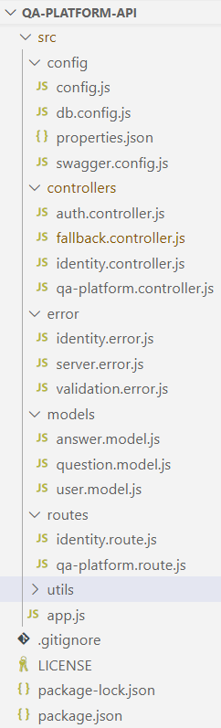

# QA-Platform

## Overview

The application serves as a platform for users to ask and answer questions, and, through membership and active participation, to vote questions and answers up or down similar to Reddit/Stack overflow and edit questions and answers

Users of application can earn reputation points and "badges" for example, a person is awarded 10 reputation points for receiving an "up" vote on a question or an answer to a question, and can receive badges for their valued contributions, which represents a gamification of the traditional Q&A website.

Users unlock new privileges with an increase in reputation like the ability to vote, comment, and even edit other people's posts.

## Features

1. A new user may register in the system using a valid email.
2. The user may login to the system to access the platform features.
3. The user may ask a question to the community.
4. The user may answer a question asked by a fellow platform user.
5. The user may browse through the questions on the platform.
6. The user may see the answers for a question on the platform.

## Additional features

1. On login, user receives a time-limited token to access the platform features without re-entering the login credentials everytime.
2. The user may update a question.
3. The user may upvote an answer to a question.
4. The user whose answer is upvoted, receives reputation points.
5. Consumers of the platform can browse and test the APIs through Swagger-UI.

## Technologies and libraries

1. [NodeJs](https://nodejs.org/en/)
2. [ExpressJs](https://expressjs.com/)
3. [Express-Validator](https://express-validator.github.io/docs/)
4. [Jsonwebtoken](https://github.com/auth0/node-jsonwebtoken)
5. [MongoDB](https://www.mongodb.com/)
6. [Mongoose](https://mongoosejs.com/)
7. [Morgan](https://www.npmjs.com/package/morgan)
8. [Swagger-UI](https://swagger.io/tools/swagger-ui/)

## Code Structure

* <strong>contract</strong>: This folder contains the platform api swagger contract.

* <strong>app.js</strong>: Entry point for the nodejs application. Registers the routes and loads the configurations. Creates a listener for incoming requests.

* <strong>src</strong>: This folder contains all the app source codes.

* <strong>config</strong>: This module contains all the app configurations.

* <strong>routes</strong>: This module contains all the request routes of the app.

* <strong>controller</strong>: This module contains all the handlers for the requests.

* <strong>model</strong>: This module contains all the MongoDb schemas.

* <strong>error</strong>: This module contains custom error classes.

* <strong>utils</strong>: This module contains all the app util implementations.



## License

```
Copyright 2022 Debdyut Hajra

Licensed under the Apache License, Version 2.0 (the "License");
you may not use this file except in compliance with the License.
You may obtain a copy of the License at

   http://www.apache.org/licenses/LICENSE-2.0

Unless required by applicable law or agreed to in writing, software
distributed under the License is distributed on an "AS IS" BASIS,
WITHOUT WARRANTIES OR CONDITIONS OF ANY KIND, either express or implied.
See the License for the specific language governing permissions and
limitations under the License.
```